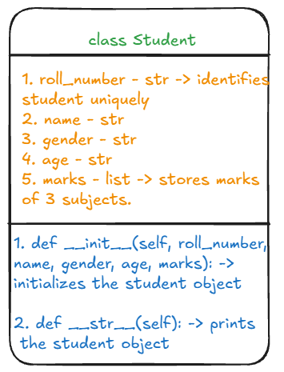

### Problem Statement

Write a Python program by creating a class named `Student`. Each student should have the following attributes:

1. Roll number
2. Name
3. Gender
4. Age
5. Marks in three subjects (stored as a list)

Implement the following methods:

1. A method to calculate and print the average marks of a student.
2. A method to determine and print the topper of the class based on average marks.
3. A method to identify and print the topper in each individual subject.
4. A `generate_report` method that prints the details of a student based on their roll number.

### Class Diagrams

  
  

