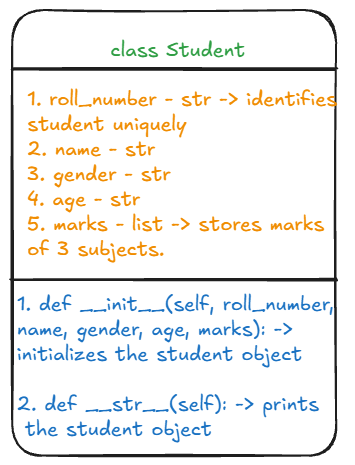
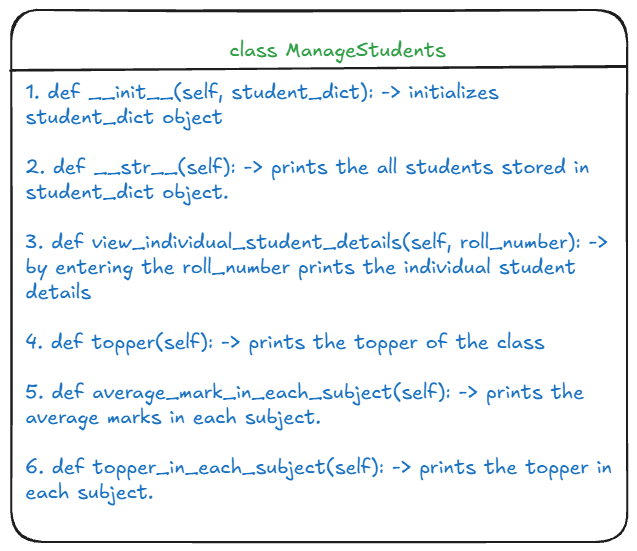
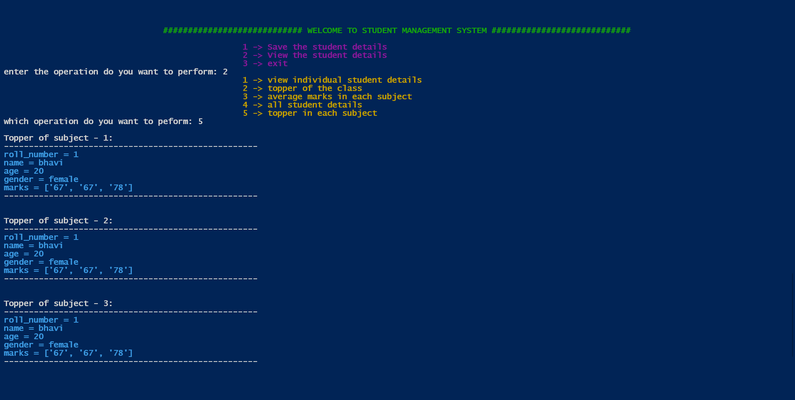

# 🧑‍🎓 Student Management System

A Python-based student management system using Object-Oriented Programming (OOP) principles. This project includes two classes — `Student` and `ManageStudents` — to handle student data, compute academic performance, and generate detailed reports.

---

## 📌 Problem Statement

Write a Python program by creating a class named `Student`. Each student should have the following attributes:

1. Roll number
2. Name
3. Gender
4. Age
5. Marks in three subjects (stored as a list)

Implement the following methods:

1. A method to calculate and print the average marks of a student.
2. A method to determine and print the topper of the class based on average marks.
3. A method to identify and print the topper in each individual subject.
4. A `generate_report` method that prints the details of a student based on their roll number.

---

## 🖼️ Class Diagrams and Output





---

## 🧾 Prerequisites

- Python 3.x installed on your system

---

## 🧪 Running the Program

1. Open a terminal
2. Navigate to the project directory
3. Run the following command:

```bash
git clone https://github.com/Bhavitha13541/StudentManagementSystem.git
cd StudentManagementSystem
python main.py
```